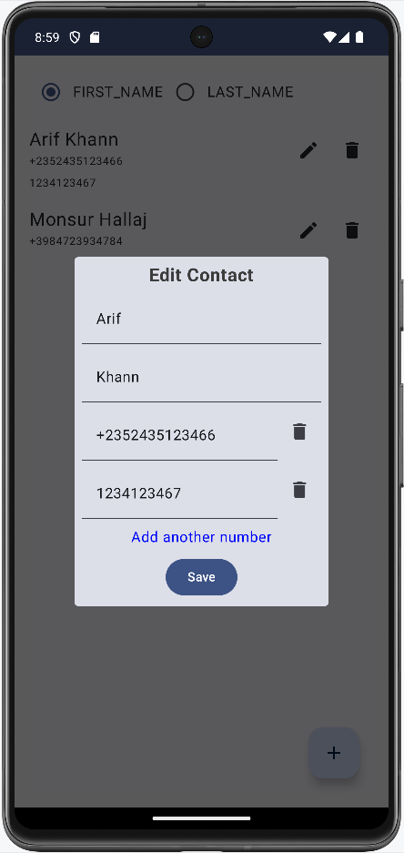

This is a sample Contact application for demonstrating examples of -
* MVI design pattern
* Jetpack Compose declarative UI
* Android Room local database
* Dagger-Hilt dependency injection
* SavedStateHandle process death survival

The idea was to use MVVM, but ended up isolating UI state and user action events on top of MVVM, which is what MVI exactly is.

Initially, the database used a single table to store a name and a corresponding phone number.

In later commits, migrations (automatic and manual) for Room Database have been used to update schema for adding the multiple phone number feature. It helped the devices running the single phone number version with some data migrate seamlessly to the new version without losing any data.

## Screenshots

    

    

    

